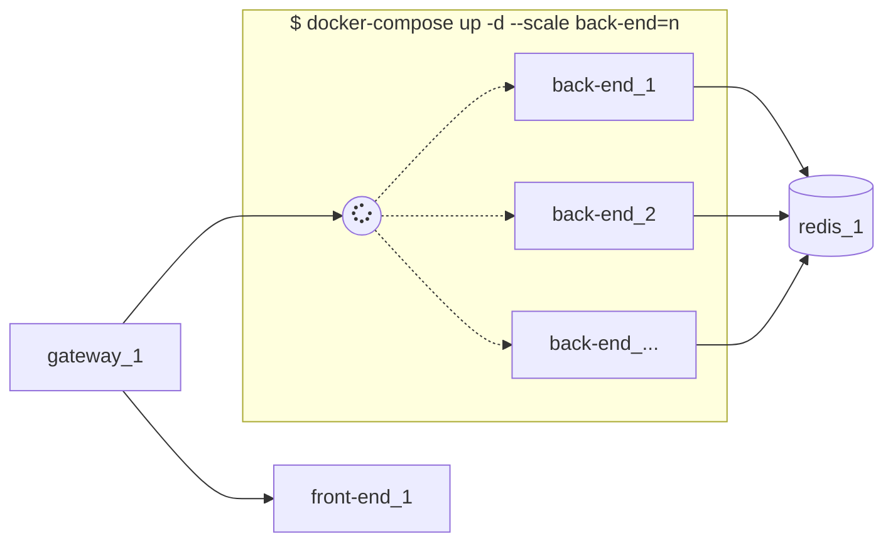

# 使用 docker-compose 编排服务的 demo

## 架构图

*使用 mermaid 渲染*



## 常用命令

```bash
# 启动
docker-compose up -d

# 查看容器启动情况
docker-compose ps -a

# 重新构建镜像
docker-compose build [SERVICE ...]

# 重启容器
docker-compose restart [SERVICE ...]

# 删除容器（-s 参数表示先停止容器）
docker-compose rm -s [SERVICE...]

# 扩展容器
docker-compose up -d --scale {SERVICE}={NUMBER}

# 实时查看日志
docker-compose logs -f [SERVICE...]

# 停止容器并移除容器、网络和镜像
docker-compose down --rmi local

# ...
```

## 水平伸缩

以本 demo 为例，back-end scale 为多实例之后，其他容器可直接通过 back-end 为 hostname 进行访问，内部会做域名解析，将请求负载均衡到 back-end 多个实例上。

但需要注意的是，本 demo 中，back-end scale 之后，前面的 nginx gateway 需要重启才能有效地将流量负载均衡到新的多实例上。
